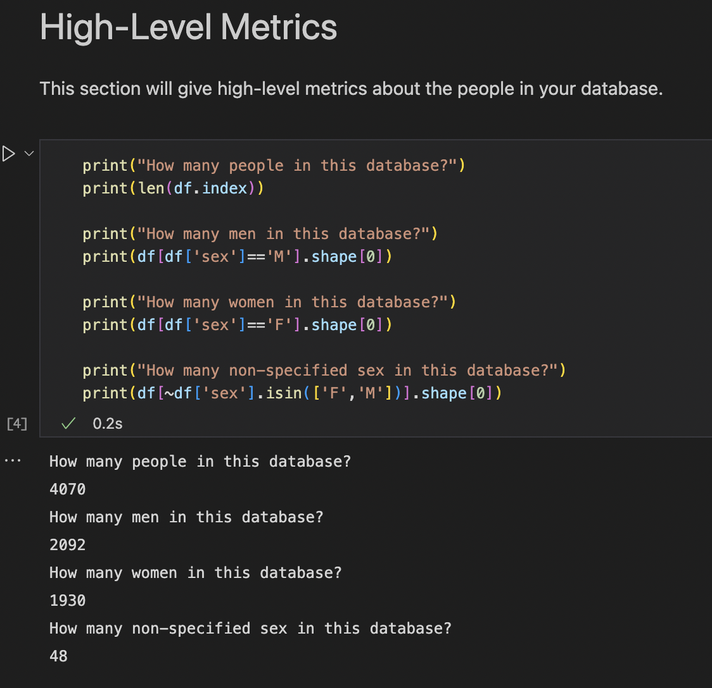

# Overview

This project is an example project for parsing gedcom data into python objects and using them to create pandas dataframes that can be used to gather aggregated data from a single gedcom file.

# Prerequisites
This project requires [Python 3.9 or later](https://www.python.org/downloads/), [pip3](https://pip.pypa.io/en/stable/installation/), [Jupyter](https://jupyter.org/) (suggest using VS Code), and a [GEDCOM](https://www.gedcom.org/) file.

# Getting Started

Start by cloning the repository:

```
git clone https://github.com/hawaiiansintech/gedcom-data
```

After cloning the github repository, open it in [Visual Studio Code](https://code.visualstudio.com/) and install the recommended extensions to view the Python notebook.

Install all python dependencies via pip3:

```
pip3 install -r requirements.txt 
```

Copy the path fo your gedcom file.

Open the file `gedcome-insights.ipynb` and click `Run All`.

You will be prompted for the path of your gedcom file in VS code, paste the path and execute.

